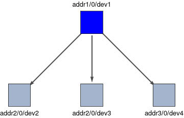
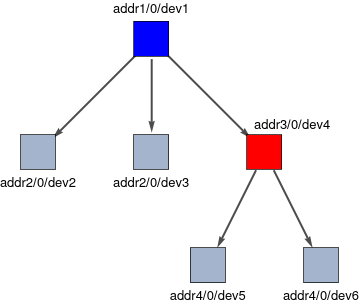
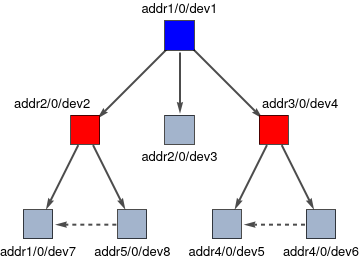
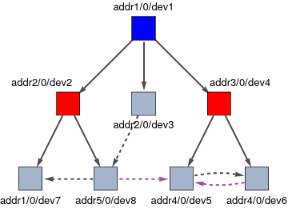
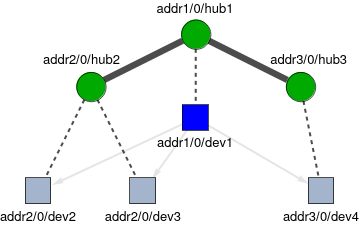
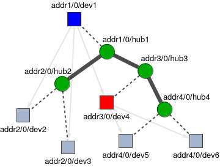

.. _devicenetwork:

==============
Device Network
==============

The STI network is made up of a set of independent devices connected together to
form a `directed graph <https://en.wikipedia.org/wiki/Directed_graph>`_.
Typically, each device is an independent driver program responsible for controlling 
a specific piece of hardware.
Some device nodes in the graph can act as a **server** for a subset of the other devices
in the network, resulting in a hierarchical strucutre.  The distinction between a 
`server` and a `device` is a semantic one; the STI library is symmetric, so any 
device can play the role of a server.  Consider the following simple device network:

   A simple STI network of three devices (gray) connected to a server (blue).
   Each device node is labeled by its unique :ref:`DeviceID` string.

Here the blue device is the server for the three gray devices. The arrows on the
graph indicate that the server `holds a device reference` to each of the devices 
connected to it. The server can communicate and control the connected devices via 
these references. Thus the arrow indicates the direction of control.

.. _devicenetworkDeviceID:
DeviceID
--------

Each device on the network has a unique DeviceID to identify it. The DeviceID
consists of three components, and has the following form when represented as a 
string:

.. code-block:: py

    <address>/<module>/<name>

* The <address> is the name of the computer that the device is running on.
  This may be an actual IP address, a domain name, or any nickname of the computer.
  Any legal string is allowed. In particular, the <address> field does *not* have to resolve
  to an official IP address as it is not used for establishing any TCP/IP connection.
* The <module> is a number that futher distinguishes the address. It may loosely be
  thought of as a port number on a computer, but once again it is not used to make 
  a TCP/IP connection.
* <name> is the name of the device. Any legal string is allowed.

.. Note::
    To be legal, the strings used in the DeviceID must be alpha numeric and 
    must avoid special characters including ( \\ / . _ ~ ! @ # $ % ^ & \* ? < > ).

In the example above, the server is located at address `addr1`, module `0`, and 
has device name `dev1`. Two of the devices (`dev2` and `dev3`) share 
the same address `addr2`.  This indicates that the two devices are
located on the same computer. The address field helps document where devices are 
running, since the STI network topology is distinct from the physical network.
Despite sharing a common address and module number, these DeviceIDs are still
unique since they have different names. 

.. warning:: 
    It is mandatory for each device on the network to have a unique DeviceID.

A device can establish a connection to another device on the network by using the 
target device's DeviceID. For instance, devices use the server's DeviceID 
in order make their initial connection.

.. _devicenetworkTargetServer:
Target Server
-------------

In addition to a unique DeviceID, each device on the network must declare a 
**target server**. The target server is the server that will be directly 
responsible for controlling the device.  In the example network above, devices 
`dev2`, `dev3`, and `dev4` each have specified device `dev1` as their target 
server. To specify a target server, the ``targetServerID`` field is set to the 
stringified DeviceID of the server in the device configuration.

Once again, any device on the network can potentially be a server. Thus a server
is defined as any device that has one or more devices which declare it as their
target server.  In the network below, the previous network has been extended, with
two more devices (`dev5` and `dev6`) that declare `dev4` as their target server:

    A hierarchical network example with two devices (gray) connected to an intermediate server (red). 
    The blue device still acts as the server of the red device, and is the root server
    of the network.

In this case, `dev4` is the server for `dev5` and `dev6`. At the same time, `dev1`
is still the server for `dev4`, so devices are arranged in a hierarchy of control.
This is useful, since it allows `dev4` to control a subset of the devices, while at
at the same time still allowing `dev1` to control the entire network.

In a connected device hierarchy, one device node is designated the **root server**.
This is the device at the top of the hierarchy that does not have a server above it.
In the examples above, the blue device (`dev1`) is the root server.
The root server must have ``targetServerID = root`` in its configuration.

Multiple independent root servers can run in parallel on the same STI network by
declaring ``targetServerID = root``. Each root server must still have a unique
DeviceID. These servers form separate device hierarchies; use a common parent
server instead when the devices need to be controlled as one connected hierarchy.

.. Note::
    With the exception of the root server, all devices must specify a target server
    in order to connect to the STI network. It is not possible to have more than one
    target server.

Establishing a target server for each device is important for ensuring that all 
devices are properly controlled and monitored by a server during timing sequences. 

Partner Devices
---------------

In addition to the connections between servers and devices, devices can acquire 
references to each other, allowing for inter-device communication. To acquire a 
reference to another device, the requesting device can declare it a 
**partner device**.  This is done by specifying the other device's DeviceID using 
``addPartner(DeviceID)``.  An example of a network with partner devices is shown
below.

    A network with two intermediate servers (red) and inter-device communication 
    between partner devices (dashed).
    Device dev5 is a partner device of dev6, while dev8 has partner dev7.

Event targets
^^^^^^^^^^^^^

Devices can optionally generate timing events on their partner devices by declaring the 
partner an **event target**. This is done by specifying the partner's DeviceID using 
``addEventTarget(DeviceID)``. Unlike the case 
of a target server, which is exclusive, a device can be a partner event target of multiple
other devices. This way a device can receive events from multiple sources, 
allowing it to act as a shared resource. This may be useful in situations when different pieces 
of hardware are tightly coupled, but should still logically be controlled by
distinct device drivers.

For example, consider a multi-channel digital output device that is used to 
provide TTL triggers for a variety of other hardware with its different channels. 
The device drivers of the other pieces of hardware may each declare the 
digital device as an event target, allowing them to request trigger events from the 
digital device as desired. This way the digital device driver remains self-contained, 
but it is still available as a resource to the other hardware device drivers. 

.. warning:: 
    Devices cannot mutually declare each other as event targets, as this would 
    imply an illegal circular dependency for timing event generation. An illegal event 
    dependency network will result in an error during timing event parsing.

An example of a more complex device network is shown below. Devices can be partners 
with any device on the network graph, including devices on different servers and 
different levels of the network hierarchy.  Devices may also be partners with each other 
to support bidirectional communication, but event targets can only go in one direction.

    A device may be partners with any other device in the network graph.
    This includes between devices connected to different servers (dev8 to dev5) and at different levels of 
    the network hierarchy (dev3 to dev8). Devices may also be partners with each other 
    (dev5 and dev6) for bidirectional communication. In contrast, partner event targets must 
    only point in one direction between devices (purple edges). In this case, dev6 has 
    declared dev5 as an event target (dev6 can generate timing events for dev5), and dev8 
    has also declared dev5 as an event target.

Network Device Hubs
-------------------

The device connections described above define the logical structure of the STI network.
However, this is an abstract network that (typically) sits on top of a physical LAN,
with communication between computer nodes over TCP/IP.
In STI, the actual TCP/IP links between nodes are managed by **device hubs**. 
Each STI device executable requires a device hub that one or more devices can 
be attached to.  The hubs then connect to each other over TCP/IP and 
automatically distribute the device references as needed to establish the device network.

Hubs are each identified on the network with a unique HubID. A stringified HubID has a 
similar format as a DeviceID:

.. code-block:: py

    <address>/<module>/<hub name>

An example hub network is shown in :numref:`hub-network-example` below, corresponding to the 
device network in :numref:`simple-network-example`.  The hubs (green circles) 
run inside the same executable as the devices that are attached to them, and so they 
share the same computer address. Hubs on different computers connect to each other over the
LAN. By default, a hub will adopt the name, address, and module of the first device that is attached
to it, although this behavior can be overridden. 
In :numref:`hub-network-example`, the hubs have been given different names for clarity.

    The associated hub network for the device network in 
    :numref:`simple-network-example`. One or more devices (gray) join the network 
    by attaching (dashed lines) to a hub (green). The hubs then connect together over TCP/IP 
    (black edges) to establish the network communication and facilitate the distribution
    of device references. The device network connectivity of :numref:`simple-network-example`
    is shown in light gray for reference.

As a more complicated example, the hub network associated with the device network in 
:numref:`hierarchical-network-example` is shown below.  Here there are four hubs 
(running in different executables, typically on different computers), corresponding 
to the four computer addresses in this example network (`addr1`, `addr2`, `addr3`, `addr4`).

    The hub network associated with :numref:`hierarchical-network-example`, which
    includes an intermediate server (dev4, red). The device network connectivity 
    is shown in light gray for reference.

To improve network efficiency, hubs attempt to connect directly to the hubs that manage the 
target servers of the their attached devices.  Hubs can be connected to multiple other hubs, 
and this will occur by default if multiple devices 
with different target servers are connected to the same hub. In :numref:`complex-hub-network`, 
`hub4` connects to `hub3` because `dev5` and `dev6` declared `dev4` as their target 
server, and `dev4` is attached to `hub3`.   However, this connection strategy 
is not required to establish the device network.  As long a hub is connected to at least 
one other hub (anywhere on the network) all its device references will be correctly exchanged via 
the hub network and will contribute to the device network.

.. note:: 
    Care must be taken when overridding the default HubID. Other hubs by default assume the 
    hub will be named after its attached device and will attempt to connect using this default.
    This may result in an orphaned hub without any connections.
    Explicit HubID targets can be provided using ``setTargetHubs`` to avoid this. In particular,
    this is necessary in the (uncommon) case where multiple target servers are attached to the 
    same hub, since then the HubID will only match one of the servers.
