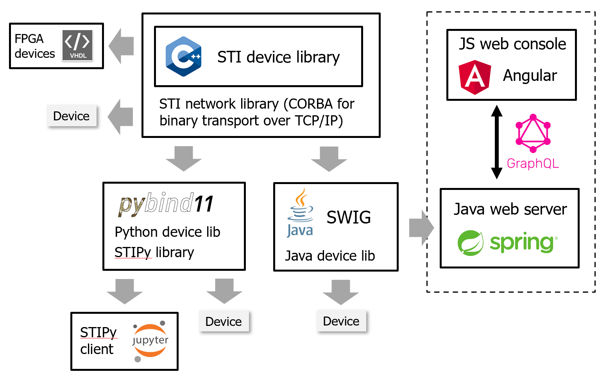

.. include global.rst

========================
STI library architecture
========================

* Core device library (C++)
* Network library (C++, CORBA)
* Java wrapper (SWIG)
* Python wrapper (pybind11)
* Spring Boot Java web server (GraphQL backend)
* Angular javascript web console (Apollo Angular GraphQL)

